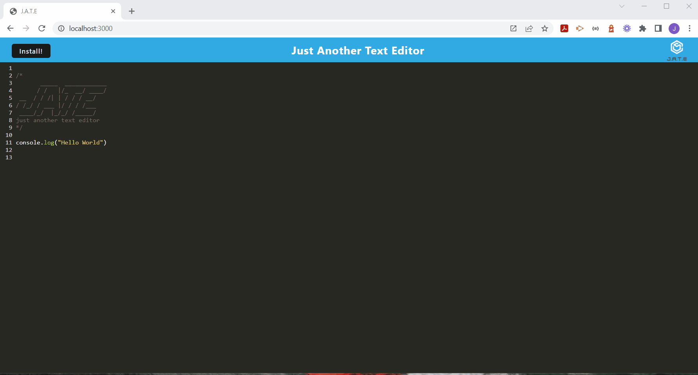
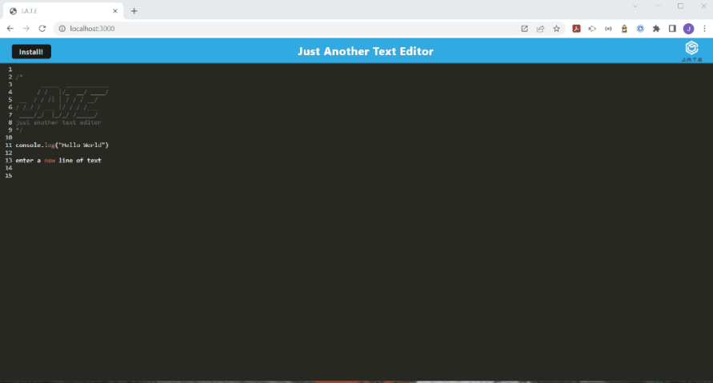

# Challenge 19 PWA: J.A.T.E

## Badges
[](https://opensource.org/licenses/MIT)

## Description

This project is J.A.T.E. Just A Test Editor Progressive Web Application. We were given completed code that needed troubleshooting to make this work as a Progressive Web App and use IndexedDB along with all the Webpack tools and configurations.

Demo of web application running in Chrome - Shows manifest, IndexedDb, and Service Workers registered:<br>


Demo of PWA Install of JATE application and Open:<br>


### Required links for review and grading submission
[Github Repository Link](https://github.com/jscobie/TextEditor)<br>
[Heroku Deployed Site](https://stark-depths-09292.herokuapp.com/)

## Table of Contents

* [Description](#description)
* [Installation](#installation)
* [Usage](#usage)
* [License](#license)
* [Tests](#tests)
* [Credits](#credits)
* [Questions?](#questions)

## Installation

**1. Clone to ***your computer*** using SSH from GitHub:**
```
git clone git@github.com:jscobie/TextEditor.git
```
**2. You'll need to run to install the node required dependencies after you clone the install by running:**
```
npm i
```
**3. You will need to build the dist folder:**
```
npm run start
```
**4. Open Chrome Browser: localhost:3000**

## Usage

The usage of this project is to allow myself to turn this project in for grading to the MSU Bootcamp academic grading team. 

## License
Read more about [MIT license](https://opensource.org/licenses/MIT).

## Tests

N/A

## Credits

Credit to the MSU Bootcamp and instructors for training and training materials to resolve some of these issues.<br>

## Questions:
*Use the following options to contact me for questions:*<br>
[jscobie](https://github.com/jscobie)<br>
jscobie@focus-solutions.net